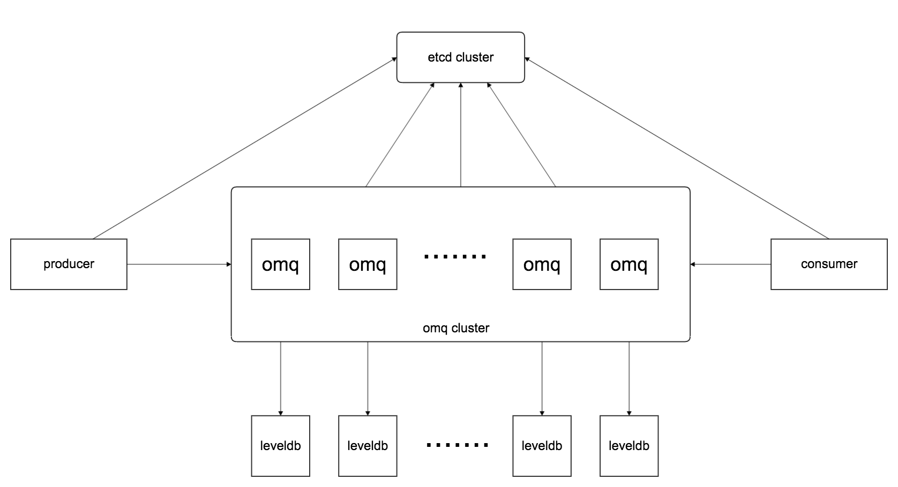

# OhMyQueue
omq(OhMyQueue) is a distributed message queue

#### 架构图
   
   
   ~~~
   ohmq is a distributed message queue written in golang
   ~~~

#### DONE list：
* Pub/Sub
* 过期数据清理
* backend storage使用rocks
* 水平扩展

#### TODO list:
* consumer group (load balance)
* backend storage支持bitcask
* cluster manager
* 重构数据结构
* 更改客户端连接逻辑
